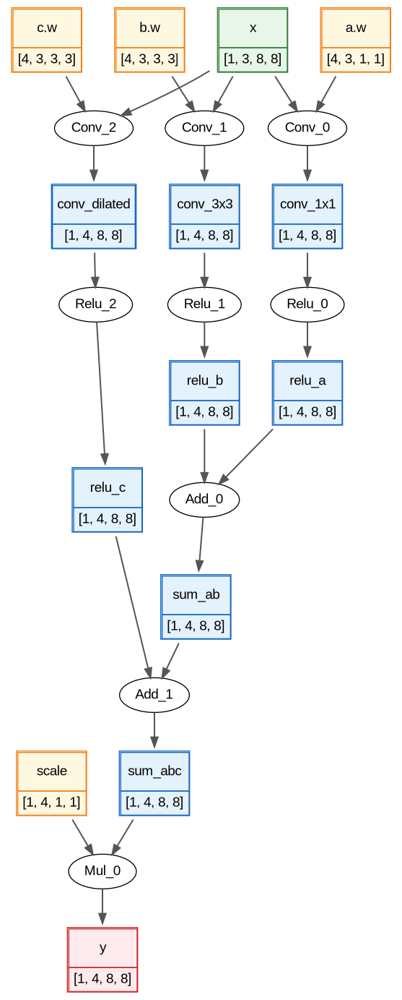

# Implementation of tensor compiler 
## Information about project:
A tensor compiler that translates ONNX models into executable code.
At the moment, only the first part, the frontend, has been implemented.

## Part I: Frontend
In this part of the project, the tensor compiler translates models in the ONNX format into an intermediate representation: a neural network graph in C++. Six operations are supported with all of their attributes, if they have any: Add, Relu, Mul, MatMul, Gemm, Conv. The output shape of each tensor is inferred during import. Graph rendering with Graphviz is also implemented.

## Requirements
- CMake 3.28+
- C++20 
- Protobuf 
- Graphviz, for rendering graphs 

## Building the project
### Frontend:
```
git clone https://github.com/VoroninMatvey/Tensor-Compiler.git
cd Tensor-Compiler
mkdir -p third_party
curl -L -o third_party/onnx.proto https://raw.githubusercontent.com/onnx/onnx/v1.17.0/onnx/onnx.proto
cmake -S . -B build
cmake --build build
```
Run the executable:
```
./build/tensor_compiler <path_to_model.onnx> [--draw-dot]
```
model.dot will be located in data/dot_models

Render the graph to an image:
```
dot -Tpng data/dot_models/model.dot -o model.png
```
Run test:
```
ctest --test-dir build --output-on-failure
```


